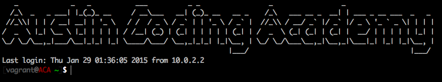
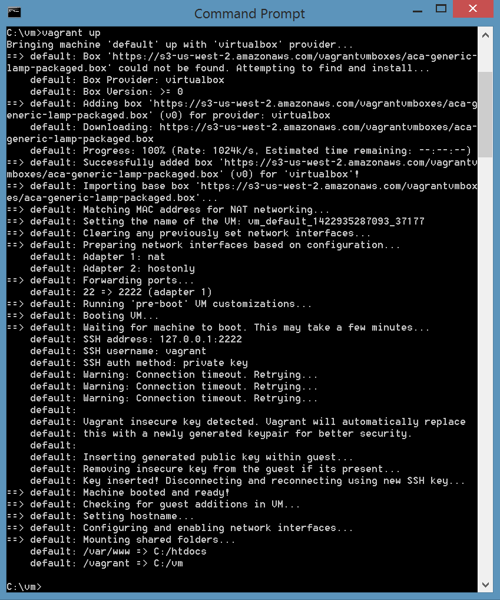

#### Developer Virtual Machine

You are required to install the following software on your computer prior to running any commands:

- [VirtualBox](https://www.virtualbox.org/) - Create and run a virtual development environment
- [git](http://git-scm.com/) - Version control system
- [Vagrant](https://www.vagrantup.com/) - Provision a virtual machine

#### Mac Instructions
Open up Terminal, copy and paste this entire command, then hit enter
```bash
cd ~/Desktop; cd VirtualMachines; vagrant destroy; cd ~/Desktop; rm -rf htdocs; rm -rf VirtualMachines; mkdir VirtualMachines; mkdir htdocs; echo "<?php phpinfo();" > htdocs/index.php; cd VirtualMachines; curl https://gist.githubusercontent.com/ryanfmurphy/5499647addb4379b1e38/raw/23890615f47530549d9761f865d7c51139a4cca8/gistfile1.txt > VagrantFile; vagrant up; vagrant ssh;
```

#### Windows Instructions
Open up your command prompt, by pressing the windows key and typing in ```command```

Once you have the command prompt open type in the following commands
```
cd \
mkdir htdocs
mkdir vm
```

Open up windows explorer, and navigate to the ```c:\``` drive.

In the ```htdocs``` folder, create a file called ```index.php``` with the following contents.
```php
<?php
phpinfo();
```

Similarly, in the vm folder, create a file called ```VagrantFile```. Note that this file has no extension, and case matters!

Copy and paste the following code in this ```VagrantFile```
```ruby
VAGRANTFILE_API_VERSION = "2"

Vagrant.configure(VAGRANTFILE_API_VERSION) do |config|
  config.vm.hostname = "aca.vm"
  config.vm.box = "https://s3-us-west-2.amazonaws.com/vagrantvmboxes/aca-generic-lamp-packaged.box"
  config.vm.network "private_network", ip: "10.10.10.60"
  config.vm.synced_folder "c:\\htdocs", "/var/www"

  config.vm.provider "virtualbox" do |vb|
    vb.gui = false
    vb.customize ["modifyvm", :id, "--memory", "1024"]
    vb.customize ["modifyvm", :id, "--cpus", "1"]
  end
end
```

Save this file, go back to your command prompt and tpe in the following commands.
```
cd \
cd vm
vagrant up
```

Once everything is complete, visit [http://10.10.10.60](http://10.10.10.60) in your browser.


#### Expected Result
You should see the following output in your mac terminal (colors may vary)


On windows, you should see the following output. You can issue ```vagrant ssh``` from within the ```c:\vm``` folder to SSH into the VM.


On mac or windows, you should see the following page in your browser
 Output")
